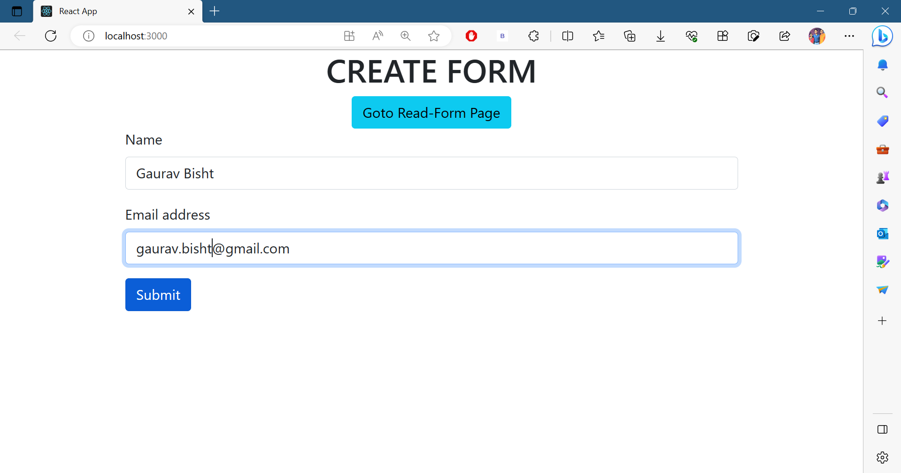
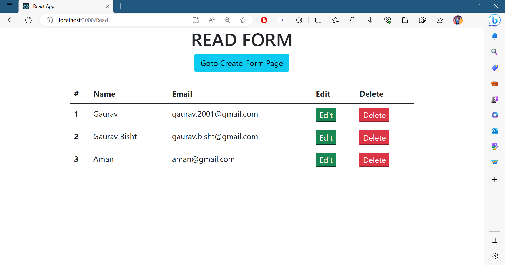
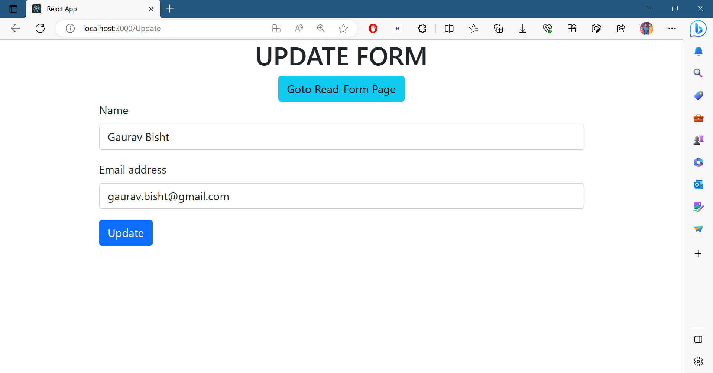

# React_Form
This project is a React form that performs all CRUD operations using React, including fetching data from an API. It helped me improve my knowledge of CRUD operations in React and how to handle user input and output.

To View the live site click [here &rarr;](https://64a9222c3571ea5f65652fdc--beautiful-mooncake-4a969d.netlify.app/)

## Features
- This form allows you to create and store entries on an API.
- You can create unlimited entries with this form.
- After submitting the form, you will be redirected to a page where you can read all the entries.
- On the read page, you can delete or edit any entry.
- Editing an entry will redirect you to another page where you can make changes.
